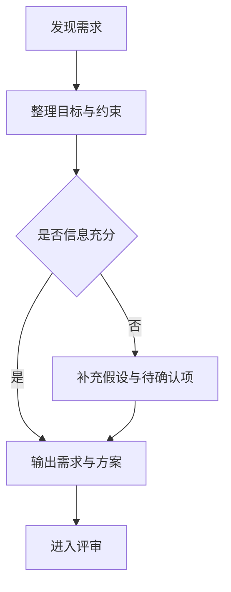
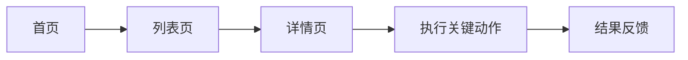
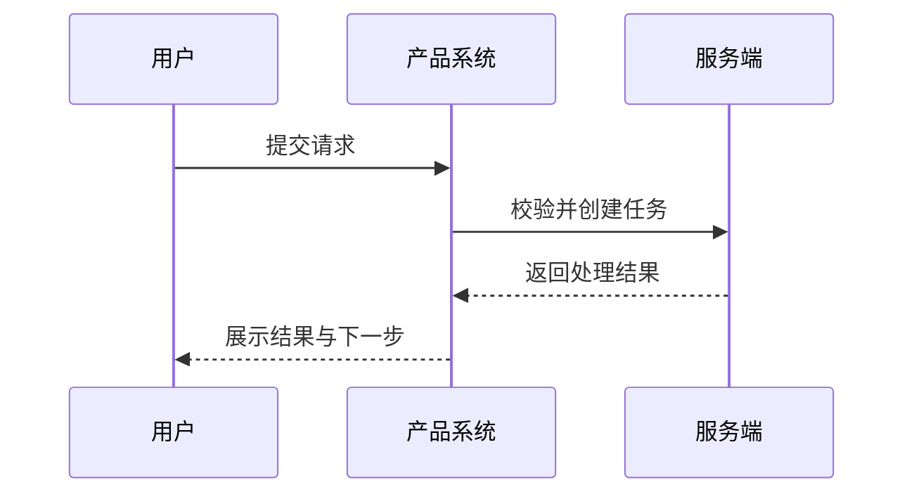
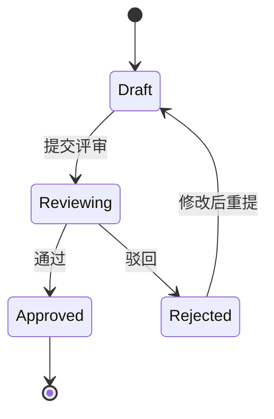

# Mermaid 使用规范

目标是稳定输出可以直接渲染的 Mermaid 图，而不是追求花哨语法。

## 选择规则

- `flowchart TD`：最适合业务流程、页面流、信息架构、审批流主干
- `flowchart LR`：适合模块关系、左右结构的信息流
- `sequenceDiagram`：适合角色与系统交互、接口调用、消息顺序
- `stateDiagram-v2`：适合状态流转、生命周期、任务状态管理
- `journey`：适合按阶段描述用户体验与痛点

## 通用约束

- 一个代码块只放一个 Mermaid 图。
- 节点 ID 使用 ASCII 字符，例如 `A1`、`user_submit`、`order_paid`。
- 中文文案放在节点显示文本里，不要放在节点 ID 里。
- 优先使用最基础的箭头、节点、分支语法，避免不必要的样式和 class 定义。
- 如果文案包含特殊字符，优先用带引号的写法，例如 `A["创建需求"]`。
- 不使用兼容性不稳定的图类型或主题配置。

## 输出前自检

- 图类型是否匹配问题本身
- 主流程是否闭环
- 异常路径是否至少覆盖最重要的一条
- 节点名称是否和正文术语一致
- 代码块是否以 ```mermaid 开始并正确结束

## 可复用骨架

### 业务流程



### 页面或模块流转



### 角色与系统交互



### 状态流转



## 建议

- 小需求通常 1 个图就够，优先画主流程。
- 中等复杂度需求优先给 2 个图：一个流程图，一个状态图或时序图。
- 如果正文已经非常长，图里只保留关键节点，避免把整份 PRD 塞进图表。
