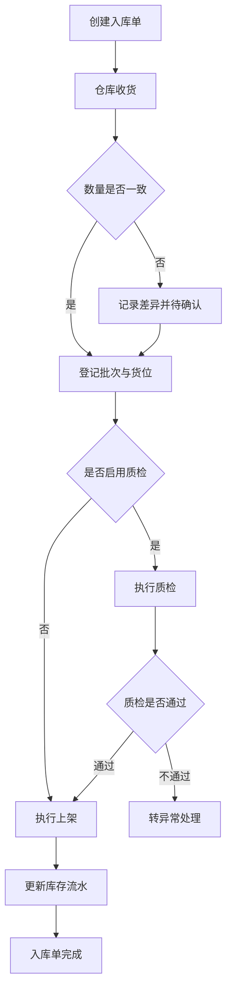
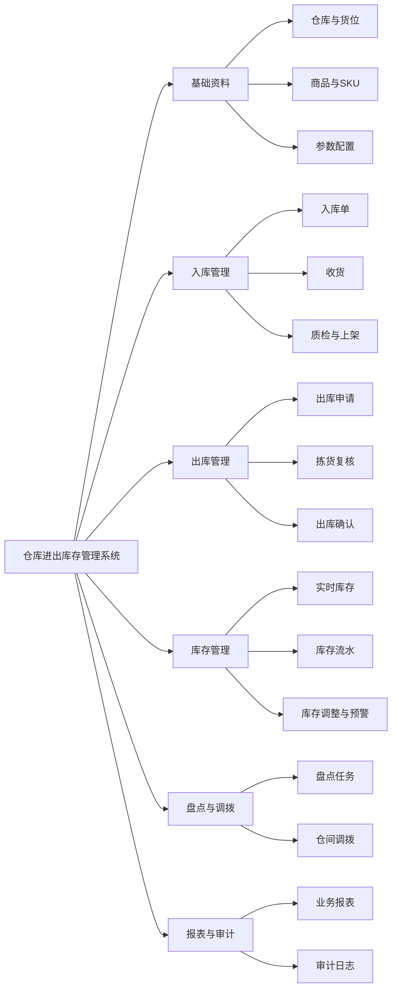
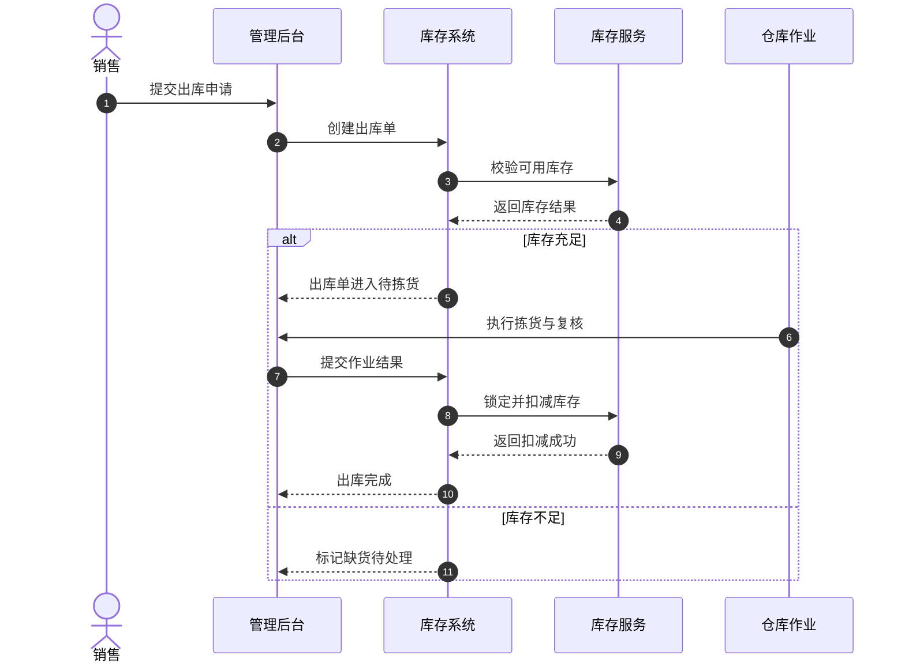

# 仓库进出库存管理系统需求设计

## 输入缺口提醒

- 缺失字段：`项目类型`
  影响：会影响终端形态、作业方式和设备接入方案。
  默认处理：先按 `Web 后台 + 标准扫码作业` 生成。
- 缺失字段：`业务背景`
  影响：会影响问题优先级、MVP 范围和收益判断。
  默认处理：先按 `Excel + 人工登记 + 多角色协同低效` 的常见仓储场景生成。
- 缺失字段：`目标用户`
  影响：会影响页面权限、角色拆分和审批边界。
  默认处理：先按 `仓库管理员 / 仓库主管 / 采购 / 销售 / 管理员` 五类角色生成。
- 缺失字段：`核心问题`
  影响：会影响系统目标、流程设计和验收标准。
  默认处理：先按 `账实不符、库存滞后、追溯困难、协同断点` 处理。
- 缺失字段：`希望实现的功能`
  影响：会影响模块边界和优先级。
  默认处理：先按 `入库、出库、盘点、调拨、库存预警、报表审计` 生成。
- 缺失字段：`成功指标`、`上线约束`、`已有系统`
  影响：会影响范围收缩、实施节奏和对接方案。
  默认处理：先按 `MVP 优先、短周期上线、从零设计` 处理。

以下内容基于默认假设生成，请人工确认。

## 需求摘要

本方案面向中小企业或单组织多仓场景，目标是建立一套可追溯、可审计、可实时更新的仓库进出库存管理系统。系统优先覆盖采购入库、销售出库、仓间调拨、库存盘点、库存调整和预警中心六类核心能力，用于替代 Excel、纸单和线下沟通带来的数据割裂问题。  
本期按 MVP 设计，重点解决库存不准、作业状态不透明、异常处理不闭环和责任难追溯的问题，不默认扩展到复杂波次、智能补货或自动化立体仓。  
交付目标是形成一套可直接评审并继续细化为页面、接口、任务拆解的产品方案。

## 项目背景

很多仓库场景在业务量增长后会暴露以下共性问题：

- 入库、出库、盘点分别使用不同表格或群消息沟通，缺少统一单据中心。
- 实际收发货已经发生，但库存系统更新滞后，导致可用库存不可信。
- 出库拣货、复核、发货之间没有明确状态衔接，异常单经常人工兜底。
- 盘点差异记录不完整，难以确认是操作失误、数据延迟还是历史账目问题。
- 管理层看不到低库存、滞销库存、频繁调整等关键经营信号。

## 问题定义

本项目需要优先解决以下问题：

- 如何让每一次入库、出库、调拨和盘点都绑定标准单据、状态和责任人。
- 如何让库存变化随着业务动作实时更新，而不是靠事后补录。
- 如何区分实际库存、可用库存、锁定库存、待上架库存和在途库存。
- 如何让异常库存调整、差异确认、强制出库等高风险动作具备审批与审计。
- 如何让采购、销售、仓库和管理层查看的是同一套库存口径。

本项目解决的是“库存作业底座”问题，不是一次性覆盖所有高级仓储能力。

## 目标用户与角色分析

### 主要角色

- 仓库管理员：执行收货、上架、拣货、复核、出库、盘点。
- 仓库主管：审批异常、管理任务、查看预警和报表。
- 采购人员：创建入库来源单、跟踪到货和差异。
- 销售人员：发起出库需求、跟踪履约状态。
- 系统管理员：维护基础资料、权限、参数和编码规则。

### 典型场景

- 采购到货后，仓库根据到货单完成收货、质检、上架并更新库存。
- 销售订单确认后，系统校验可用库存并生成出库任务。
- 仓库根据盘点计划执行实盘，并在确认差异后生成调整单。
- 两个仓之间发生调拨时，系统记录调出、在途、调入的完整链路。

## 业务目标与成功指标

### 业务目标

- 建立统一仓库单据和库存台账。
- 提升库存准确率和作业透明度。
- 降低异常操作对业务履约的影响。
- 为经营管理提供可信库存数据。

### 成功指标

- 核心出入库业务系统覆盖率达到 95% 以上。
- 库存变更同步延迟控制在 5 秒以内。
- 月度盘点账实差异率控制在 2% 以下。
- 常规出库任务平均处理时长较现状下降 30%。
- 异常调整 100% 具备操作人、时间、原因和审批记录。

## 范围定义

### 本期范围

- 仓库、库区、货位、商品、SKU、单位基础资料管理。
- 采购入库、销售出库、库存调整、库存盘点、仓间调拨。
- 库存查询、库存流水、低库存预警、临期预警。
- 单据状态流转、权限控制、审计日志、异常处理。

### 非本期范围

- 自动补货算法。
- 波次拣货和路径优化。
- 自动化设备控制。
- 多法人独立账套。
- 复杂财务成本核算。

### MVP 建议

- 首期按单组织、多仓库模式设计。
- 首期默认支持 Web 后台和标准扫码录入，不单独设计复杂 PDA 客户端。
- 首期审批采用固定节点，不引入可配置工作流引擎。

## 风险与依赖

- 商品主数据不规范会直接影响入库、出库和盘点质量。
- 若历史库存底账不准，上线前需要安排专项盘点。
- 是否启用批次、保质期、序列号管理，会显著增加字段与流程复杂度。
- 若需要与 ERP、采购系统、销售订单系统对接，接口边界需提前锁定。

## 业务流程说明

### 入库流程

1. 采购或调拨来源生成入库单。
2. 仓库执行收货并录入实收数量、批次、货位。
3. 系统校验差异，必要时进入异常确认。
4. 如启用质检，则先完成质检再上架。
5. 上架完成后，库存转为可用状态并写入库存流水。

### 出库流程

1. 销售或领料需求创建出库单。
2. 系统校验可用库存并锁定数量。
3. 仓库执行拣货、复核和出库确认。
4. 出库成功后扣减可用库存并记录流水。
5. 若库存不足或数量不一致，进入异常待处理。

### 盘点流程

1. 仓库主管创建盘点任务并圈定范围。
2. 仓库管理员执行实盘并录入盘点结果。
3. 系统比对账面数量与实盘数量。
4. 差异确认后生成库存调整单并更新台账。

## 功能模块拆解

### 1. 基础资料管理

- 仓库管理：仓库编码、名称、状态、负责人。
- 库区货位管理：库区、货架、货位、容量属性。
- 商品管理：SKU、条码、规格、分类、单位。
- 参数配置：批次、保质期、负库存、预警阈值开关。

### 2. 入库管理

- 入库单创建、导入、查询、取消。
- 收货登记：实收数量、批次、生产日期、备注。
- 质检处理：合格、不合格、待确认。
- 上架确认：目标货位、上架数量、上架时间。

### 3. 出库管理

- 出库申请单创建、审核、取消。
- 库存校验、锁定与释放。
- 拣货任务生成与执行。
- 复核、发货、出库确认。

### 4. 库存管理

- 实时库存查询。
- 库存流水追溯。
- 库存调整：报损、报溢、纠错。
- 预警中心：低库存、临期、异常库存。

### 5. 盘点与调拨

- 盘点任务创建、执行、确认、关闭。
- 调拨单创建、调出、在途、调入确认。
- 差异分析与处理记录。

### 6. 报表与审计

- 出入库日报、库存余额表、库存流水表。
- 盘点差异报表、异常操作报表。
- 审计日志、审批日志、操作日志。

## 页面结构或信息架构

### 后台主导航

- 工作台
- 基础资料
- 入库管理
- 出库管理
- 库存管理
- 盘点管理
- 调拨管理
- 预警中心
- 报表中心
- 系统设置

### 关键页面

- 入库单列表页：支持筛选、导入、查看差异状态。
- 入库单详情页：展示单头、明细、收货、质检、上架记录。
- 出库任务页：支持拣货、扫码复核、异常标记。
- 库存查询页：按仓库、货位、SKU、批次查询。
- 盘点任务页：展示任务范围、执行进度、差异结果。

## 状态流转说明

### 入库单状态

- 草稿
- 待收货
- 收货中
- 待质检
- 待上架
- 已完成
- 异常待处理
- 已取消

### 出库单状态

- 草稿
- 待审核
- 待拣货
- 拣货中
- 待复核
- 已出库
- 异常待处理
- 已取消

### 调拨单状态

- 草稿
- 待调出
- 在途
- 待调入
- 已完成
- 已取消

## 业务规则与约束

### 库存口径

- 可用库存 = 实际库存 - 锁定库存。
- 待上架库存不允许参与出库校验。
- 在途库存仅用于调拨链路跟踪，不计入目标仓可用库存。

### 单据规则

- 单据编号必须唯一，按业务类型生成前缀。
- 已完成单据不可直接删除，只允许红冲或生成调整记录。
- 单据取消必须保留取消原因、操作人和时间。

### 权限规则

- 仓库管理员仅可操作授权仓库范围内的单据。
- 库存调整、强制出库、异常关闭需主管以上权限。
- 报表下载与库存金额查看权限可独立控制。

### 异常规则

- 收货数量与来源单差异超过阈值时，必须进入异常确认。
- 出库库存不足时，系统不可直接完成出库。
- 盘点差异超过阈值时，需主管确认后才允许写入调整。

## 异常与边界场景

- 条码重复或缺失导致扫码识别失败。
- 货位停用但仍有库存时，不允许继续分配新任务。
- 出库执行中订单被撤回时，需要自动释放锁定库存。
- 多批次出库需要明确先进先出或人工指定策略。
- 盘点期间是否冻结出入库，需要按仓库维度配置。
- 系统重试或接口超时场景下，库存扣减必须保证幂等。

## 后台配套设计

### 系统设置

- 编码规则配置。
- 批次和保质期开关。
- 预警阈值配置。
- 仓库权限与角色配置。

### 审计与运维

- 所有库存变更必须记录前值、后值、来源单据、操作人、时间。
- 关键动作写入审计日志，包括库存调整、单据取消、权限变更。
- 支持按单据号、SKU、操作人、时间范围快速检索问题记录。

## Mermaid 图表

### 业务流程图：展示入库到库存生效的主链路。

### 功能结构图：展示系统模块边界与关系。

### 时序图：展示销售出库从申请到库存扣减的协同过程。

## 验收标准

- 入库单可完成收货、差异处理、上架并写入库存流水。
- 出库单可完成库存校验、锁定、拣货、复核和扣减。
- 盘点任务可记录实盘结果，并在确认差异后生成调整记录。
- 所有库存变化都可以按单据号追溯到来源业务。
- 不同角色只能访问其授权的仓库范围和功能范围。
- 低库存与异常库存能够自动触发预警并进入预警中心。

## 信息缺口与待确认项

### 当前假设

- 默认系统形态为 Web 后台。
- 默认不允许负库存出库。
- 默认按先进先出处理多批次出库。
- 默认企业当前没有成熟库存系统，需要从零建设。

### 需要业务确认的规则

- 是否启用批次、保质期、序列号管理。
- 是否需要区分销售出库、领料出库、退货出库等业务类型。
- 调拨、库存调整、异常关闭是否需要审批。
- 盘点期间是否允许继续出入库。

### 需要技术确认的依赖

- 是否需要对接 ERP、采购系统、订单系统。
- 是否需要支持 PDA、扫码枪、打印机等设备。
- 是否存在离线作业与补同步需求。

### 可能影响排期或范围的风险

- 主数据清洗工作量可能高于预期。
- 历史库存差异会影响上线切换时间。
- 若审批链复杂，本期范围需要进一步收缩。
